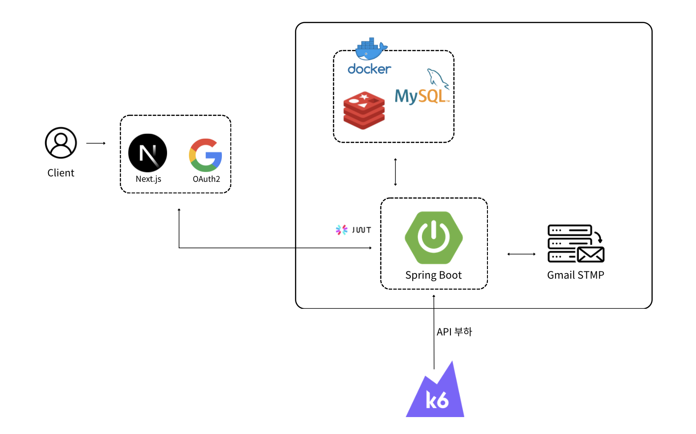

# 달려라 마라톤

달려라 마라톤은 흩어져 있는 마라톤 대회 정보를 한곳에서 조회하고, 참가자가 원하는 코스에 접수할 수 있도록 돕는 마라톤 통합 플랫폼입니다.

이 저장소는 회원 인증, 마라톤 대회 관리, 참가 접수, 주최자용 참가자 조회, 알림 및 모니터링 기능을 제공하는 Spring Boot 기반 백엔드 API 서버입니다.

## 주요 기능

- 이메일 회원가입, 로그인, 로그아웃, 토큰 재발급
- Google OAuth2 로그인
- 쿠키 기반 JWT 인증 및 사용자 권한 분리
- 내 프로필 조회, 수정, 소셜 로그인
- 관리자 주최자 권한 승인
- 주최자 마라톤 대회 생성, 수정, 취소, 조회
- 참가자 마라톤 목록 및 상세 조회
- 참가자 마라톤 코스 접수, 내 접수 목록 조회, 접수 취소
- 주최자 접수 요약, 참가자 목록, 참가자 상세 조회
- 접수 완료 및 대회 취소 이메일 알림
- Actuator, Prometheus, Grafana 기반 모니터링

## 기술 스택

| 구분 | 기술 |
| --- | --- |
| Language | Java 21 |
| Framework | Spring Boot 3.5.13 |
| Build | Gradle Kotlin DSL |
| Database | MySQL 8.0 |
| Cache / Lock | Redis, Redisson |
| Persistence | Spring Data JPA, Hibernate |
| Security | Spring Security, JWT, OAuth2 Client |
| API Docs | Springdoc OpenAPI |
| Monitoring | Prometheus, Grafana |

## 시스템 구조



## 패키지 구조

```text
backend/src/main/java/com/rungo/api
├── domain
│   ├── auth               # 인증, 로그인, 토큰 관리
│   ├── marathon           # 마라톤 대회 및 코스 관리
│   ├── notification       # 메일 알림 이벤트 처리
│   ├── registration       # 참가 접수, 조회, 취소
│   └── users              # 사용자, 관리자, 주최자 승인
└── global
    ├── config             # 전역 설정
    ├── exception          # 공통 예외 처리
    ├── file               # 파일 업로드 처리
    ├── infrastructure     # 외부 인프라 연동
    ├── response           # 공통 응답 형식
    ├── security           # 인증/인가 보안
    ├── springDoc          # Swagger 문서 설정
    └── util               # 공통 유틸
```

## 핵심 설계 의사결정

### 1. 대회 접수 동시성 제어

대회 접수 기능에서는 여러 사용자가 동시에 같은 코스에 신청할 경우 정원 초과 접수와 `currentCount` 정합성 문제가 발생할 수 있습니다.

동시성 제어 방식으로 **원자적 업데이트 vs 비관적 락**을 비교하여 원자적 업데이트 방식을 채택하였습니다.

### 테스트 조건

- 총 요청 수: 1000명
- 동시 요청: 100 / 500
- 시나리오: 동일 코스 접수 요청

### 결과

| 동시 요청 | 원자적 업데이트 | 비관적 락 | 성능 차이 |
| --- | --- | --- | --- |
| 100 | 286ms | 328ms | 약 12.7% 빠름 |
| 500 | 1.04s | 1.26s | 약 17.5% 빠름 |

원자적 업데이트는 비관적 락보다 대기 시간이 적고, 낙관적 락처럼 재시도 정책을 두지 않아도 되기 때문에 성능과 구현 복잡도의 균형이 가장 좋다고 판단했습니다.

### 2. 중복 신청 방지

한 사용자는 동일한 대회에서 하나의 코스만 신청할 수 있도록 제한했습니다.

이를 위해 `user_id`와 `marathon_id`를 기준으로 복합 유니크 제약을 두는 방식을 우선 채택했습니다.

```sql
UNIQUE (user_id, marathon_id)
```

복합 유니크 방식은 DB 레벨에서 중복 신청을 직접 막기 때문에, 동시 요청 상황에서도 애플리케이션에서 복잡한 중복 제어 로직을 두지 않아도 안정적으로 처리할 수 있습니다.

### 3. 접수 취소 및 재신청 데이터 설계

접수 취소 이후 사용자가 다시 신청할 수 있어야 하며, 동시에 기존 접수 이력도 관리할 수 있어야 합니다.

이를 위해 다음 세 가지 방식을 비교했습니다.

| 방식 | 장점 | 단점 |
| --- | --- | --- |
| 유니크 제약 제거 후 애플리케이션 제어 | 유연한 제어 가능 | 기존 복합 유니크 키를 제거해야 하며, 중복 방지를 애플리케이션 로직에 의존 |
| 하드 딜리트 + 이력 테이블 분리 | 재신청과 정합성 확보, 데이터 의미 명확 | 관리 테이블 증가 |
| `canceled_at` 포함 복합 유니크 | 재신청 가능 | `NULL` 처리와 기본값 사용으로 데이터 의미가 왜곡될 수 있음 |

최종적으로는 하드 딜리트와 이력 테이블 분리 방식을 가장 적절한 방향으로 판단했습니다.

현재 접수 데이터는 활성 접수 상태만 관리하고, 취소 이력은 별도 테이블에서 관리하는 구조가 데이터 의미가 명확하고 유지보수에 유리하다고 보았습니다.

### 4. Redis 기반 Refresh Token 관리

Refresh Token은 재발급과 로그아웃 처리를 위해 서버에서도 관리가 필요합니다.

처음에는 RDB 저장도 고려했지만, 멘토링을 통해 사용자 정보는 RDB에서 관리하고 토큰과 같은 인증 정보는 Redis로 분리하는 방향이 더 적절하다는 피드백을 받았습니다.

| 항목 | RDB | Redis |
| --- | --- | --- |
| 저장 방식 | 디스크 기반 저장 | 메모리 기반 저장 |
| 만료 처리 | 별도 만료 처리 로직 필요 | TTL 기능으로 자동 만료 |
| 조회 방식 | SQL 기반 조회 | Key 기반 조회 |
| 속도 | 상대적으로 느림 | 빠름 |

Redis는 메모리 기반으로 빠르게 조회할 수 있고, TTL 기능을 통해 Refresh Token 만료 시간을 자동으로 관리할 수 있습니다.

현재는 단일 인스턴스 환경이라 다소 과한 선택일 수 있지만, 학습 및 실무 관점에서 확장성과 성능을 고려해 Redis를 도입했습니다.

### 5. Refresh Token 재발급 동시성 제어

동일한 사용자가 동시에 토큰 재발급을 요청하면 각각 새로운 Refresh Token이 발급되고, 마지막 요청이 Redis의 기존 값을 덮어쓸 수 있습니다.

이 경우 클라이언트가 가진 토큰과 서버에 저장된 토큰이 불일치하여 인증 오류가 발생할 수 있습니다.

이를 해결하기 위해 낙관적 락, 비관적 락, Redis 기반 분산 락을 비교했습니다.

| 방식 | 장점 | 한계 |
| --- | --- | --- |
| 낙관적 락 | DB 락 대기 시간이 적음 | 충돌 발생 시 재시도 필요 |
| 비관적 락 | 강한 정합성 보장 | DB 락 대기와 데드락 위험 |
| Redis 분산 락 | 메모리 기반으로 빠르고 다중 인스턴스 환경에도 대응 가능 | 락 만료 시간과 예외 상황에 대한 설계 필요 |

저희는 이미 Refresh Token을 Redis에 저장하고 있었기 때문에, 별도의 인프라 추가 없이 Redis 기반 분산 락을 적용할 수 있었습니다.

또한 향후 서버가 여러 대로 확장될 경우에도 Redis가 중앙에서 락을 관리할 수 있기 때문에, 인스턴스 수와 관계없이 일관된 동시성 제어가 가능하다고 판단했습니다.

따라서 Refresh Token 재발급 과정의 동시성 제어에는 Redis 기반 분산 락을 선택했습니다.

## 시작하기

### 요구 사항

- Java 21
- Docker
- Docker Compose

### 인프라 실행

루트 디렉터리에서 MySQL과 Redis를 실행합니다.

```bash
docker compose up -d
```

기본 연결 정보는 다음과 같습니다.

| 항목 | 값 |
| --- | --- |
| MySQL | `localhost:13306` |
| Database | `rungo` |
| Username | `root` |
| Password | `root` |
| Redis | `localhost:16379` |

### 환경 변수

애플리케이션 실행 전에 다음 환경 변수를 설정합니다. 로컬 실행 시에는 `backend/.env` 파일을 사용할 수 있습니다.

```text
JWT_SECRET=your-jwt-secret
MAIL_USERNAME=your-mail@example.com
MAIL_PASSWORD=your-mail-password
GOOGLE_CLIENT_ID=your-google-client-id
GOOGLE_CLIENT_SECRET=your-google-client-secret
```

메일 발송을 사용하지 않을 경우 `backend/src/main/resources/application.yaml`의 `app.mail.enabled` 값을 로컬 환경에 맞게 조정합니다.

### 애플리케이션 실행

```bash
cd backend
./gradlew bootRun
```

서버는 기본적으로 `http://localhost:8080`에서 실행됩니다.

## API 문서

애플리케이션 실행 후 Swagger UI에서 API 명세를 확인할 수 있습니다.

- Swagger UI: `http://localhost:8080/swagger-ui/index.html`
- OpenAPI JSON: `http://localhost:8080/v3/api-docs`

API 응답은 공통 응답 객체인 `ApiResponse<T>` 형식을 사용합니다.
